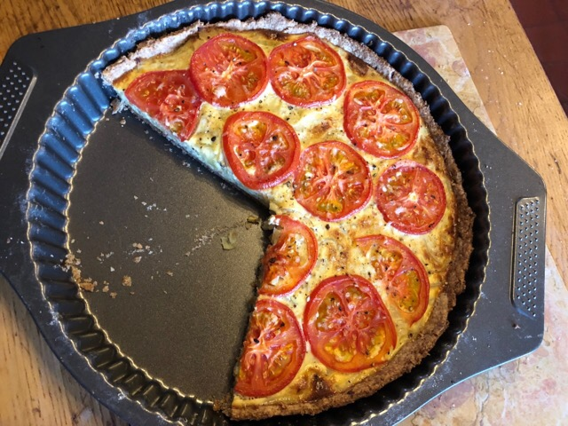

+++
title = "Onion and Tomato Tart"
date = 2018-05-07T21:58:00Z
tags = ["mains", "picnic"]
categories = ["recipe"]
draft = false
slug = "tomato-and-onion-tart"
+++ 

I love savoury flans, tarts and quiches. They're lovely straight out of the oven but just as good cold and since the best way to eat is to picnic, they are top billing in my house right now. This beastie is packed with flavour but a doddle to make. 

<!--more-->

## About

A note about measures: my flan tin is enourmous at 13" in diameter. For a more conventional 10" tin, leave out 1 onion, 1 whole egg and use 150ml of cream. 

**Time** about 45 mins, **Difficulty** Easy, **Serves** 12

## Ingredients

### Pastry base

See my [pastry] recipe for a basic recipe. For my giant tin, I use 10oz flour, 5oz butter. 

### Filling

1. 4 big white onions
2. 4 tomatoes
2. 1 clove of garlic, crushed
2. 200ml of double cream
3. 3 whole eggs plus 2 yolks
5. 3tsp of whole grain mustard
6. Salt and pepper to season
7. Butter and oil for frying and greasing

## Method

Make your pastry and pop it in the fridge to chill for a bit. I love the nutty taste that wholemeal flour adds to savoury tarts and I'm genuinely lucky to be able to get mine fairly locally from the awesome [Talgarth Mill](http://talgarthmill.com). 

While the pastry is chilling, peal, halve and slice the onions. In a pan add a good knob of butter with a splash of oil to stop the butter burning. Put it on a low heat and, when the butter has melted, throwing the onions, garlic and give it a good seasoning. Put a lid on the onions and stir occasionally for abour 20 minutes. You want them lovely a soft and with much of their water evaporated. 

Roll out your pastry and put in the flan tin, remembering to grease it first. Pop it in a low oven for about 15 mins to bake. 

Meanwhile, whisk the eggs with the cream and mustard. On the subject of mustard, there is none better than [Moutarde Royale au Cognac Pommery](http://www.moutarde-de-meaux.com/en/2-moutarde-500g/10-the-moutarde-royale-cognac-pommery-500g.htm). It's a game-changer for any recipe that calls for wholegrain mustard. Marks and Spencers stock it.

When the pastry is ready and the onions are done, take both off the heat. Mix the eggy mixture through the onions and spread it over pastry base. Top with the tomatoes thinly sliced. Pop the tart back in the oven at a medium high temperature until the tart has set and turned golden brown. 

