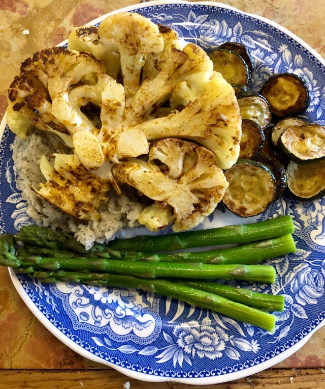

+++
title = "Cauliflower Steak"
date = 2018-06-04T22:30:00Z
tags = ["mains"]
categories = ["recipe"]
draft = false
slug = "cauliflower-steak"
+++ 

Everyone and their dog has a cauliflower steak recipe. Here’s mine.

<!--more-->

## About
Frying is involved here but I’ve avoided deep-frying in inches-deep oil and at the same time makes sure that even the thick stem is tender. Experiment with different spice mixes too. 

**Time** about 30 mins, **Difficulty** Easy, **Serves** 2

## Ingredients
1. a lovely big cauliflower
2. vegetable stock
3. oil for brushing
4. spice mix (I used ras el hanout because I had it to hand)

## Method
Cut the cauliflower in half through the stalk. Then cut an inch thick ‘steak’ slices from each side, stalk and all.

Mix some vegetable stock and put in a baking tray along with the steaks. The stock wants to be about half way up each slice. Pop in a medium oven for 20 minutes, flipping over halfway through.

Once done, the thick part of the stem should be just tender. Take out of the stock and allow it steam off some of the moisture for 5 minutes.

Brush with a bit of oil and some of your chosen spice mix. Fry on a hot hob in a bit of clear oil for a few minutes until the edges start to go a bit crispy.

> You’re not going to throw out the rest of the cauliflower are you? Boil the remainder until soft, whack it in a blender with a bit of milk / cream / soy milk and some herbs like thyme. 